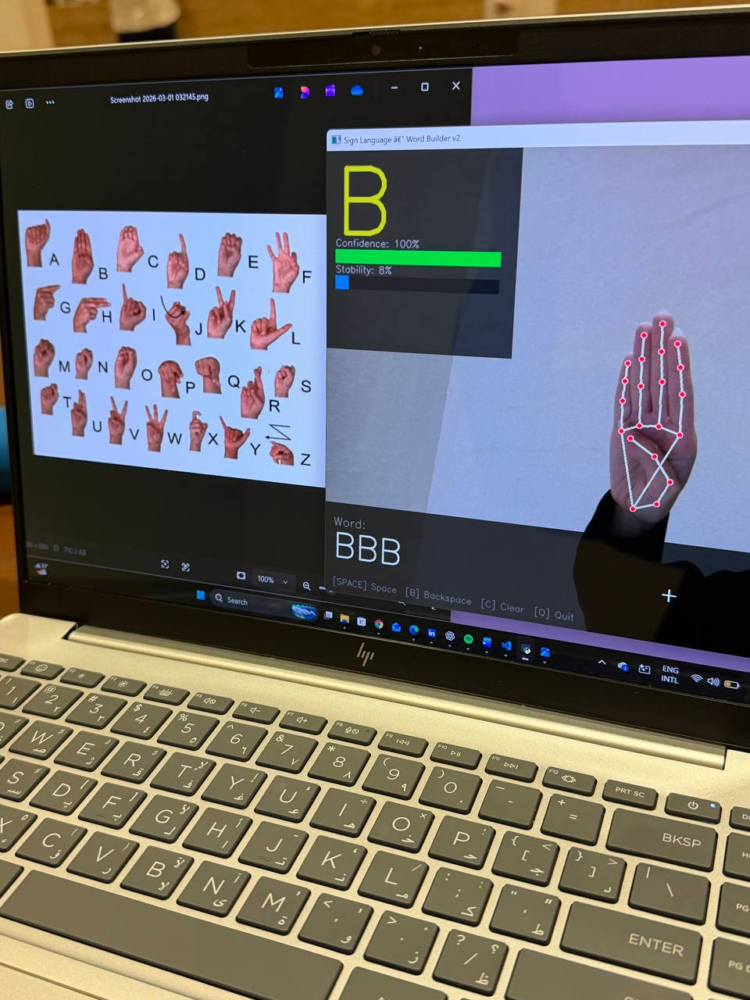
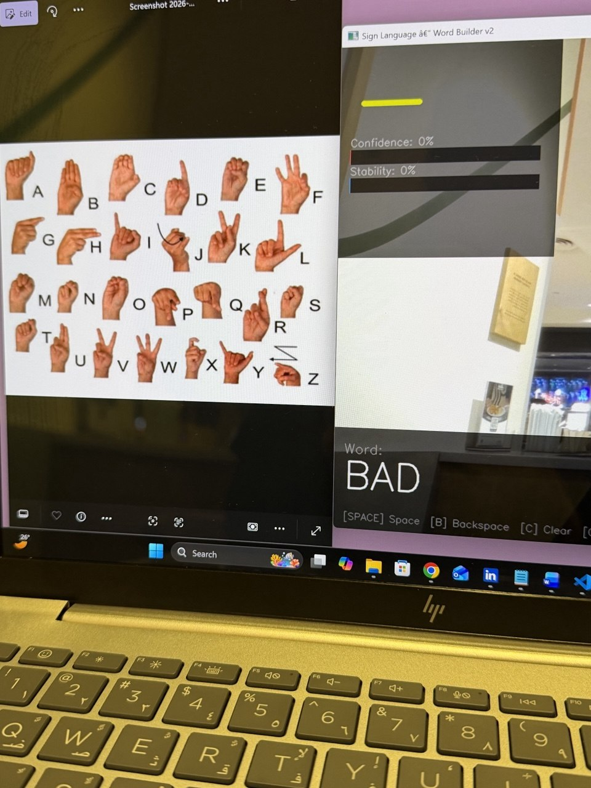

# 🤟 Real-Time ASL Sign Language Recognition

> **End-to-end pipeline** for recognizing the full American Sign Language (ASL) alphabet (A–Z + del + space) in real time using a standard webcam — no GPU required.

**M.Sc. Artificial Intelligence · King Faisal University · May 2026**  
*Machine Learning for Computer Vision — Supervised by Dr. Mohammed Shujaa*

-----

## 🎯 Results at a Glance

|Model        |CV Accuracy (3-fold)|Test Accuracy|
|-------------|--------------------|-------------|
|Random Forest|97.79%              |97.80%       |
|KNN (k=5)    |99.45%              |99.45%       |
|**SVM RBF ✓**|**99.87%**          |**99.55%**   |

- **28 classes** — full A–Z alphabet + `del` + `space`
- **83,076** augmented training samples
- Runs entirely on **CPU** with a standard webcam
- Live **Word Builder** — spell any word by signing letters in sequence

-----

## 📸 Demo

|MediaPipe Landmarks + Word Builder|Full Alphabet + “BAD” Output|
|----------------------------------|----------------------------|
|        |  |


> Live demo: sign **B** detected at **100% confidence** with MediaPipe landmarks overlaid. Word Builder successfully composed **“BAD”** by signing B → A → D in sequence.

📄 **[Read the Full Academic Report (PDF)](SignLanguageReportkfu2026.pdf)**

-----

## 🏗️ System Pipeline

```
Webcam Input
    │
    ▼
1_Data_Collector.py      ──►  raw_data.csv
    │
    ▼
1b_Kaggle_Extractor.py   ──►  raw_data.csv  (merged with Kaggle ASL dataset)
    │
    ▼
2_Augment_Data.py        ──►  augmented_data.csv  (83,076 samples, 28 classes)
    │
    ▼
3_Train_v2.py            ──►  sign_model.pkl  (SVM, 99.55% test accuracy)
    │
    ▼
4_Real_Time_v2.py        ──►  Live recognition + Word Builder
```

Each stage is **independent and replaceable** — swap the classifier, add more signs, or retrain with new data without touching other modules.

-----

## ✨ Features

- **Full ASL Alphabet** — 28-class classifier covering all 26 letters plus `del` and `space`
- **Real-Time Inference** — majority-vote prediction buffer (15 frames) for stable output
- **Confidence & Stability Bars** — live visual feedback on prediction quality
- **Word Builder** — hold a sign for 1.2 seconds to commit a letter; build any word
- **6 Augmentation Techniques** — noise, scale, mirror, rotation, translation, combined
- **3-Model Comparison** — Random Forest vs SVM vs KNN with CV evaluation
- **Modular Launcher** — `Run_project.py` menu to run any pipeline stage

-----

## 🛠️ Tech Stack

|Category       |Tools                                 |
|---------------|--------------------------------------|
|Hand Tracking  |MediaPipe Hands (21 landmarks × 3D)   |
|ML Framework   |scikit-learn (SVM, Random Forest, KNN)|
|Computer Vision|OpenCV                                |
|Data Processing|Pandas, NumPy                         |
|Visualization  |Matplotlib, Seaborn                   |
|Language       |Python 3.10                           |

-----

## 📁 Project Structure

```
sign-language-recognition/
│
├── Run_project.py              # ← Start here — launcher menu
│
├── 1_Data_Collector.py         # Stage 1: Collect webcam landmarks
├── 1b_Kaggle_Extractor.py      # Stage 1b: Extract landmarks from Kaggle images
├── 2_Augment_Data.py           # Stage 2: Data augmentation (6 techniques)
├── 3_Train_v2.py               # Stage 3: Train & evaluate 3 classifiers
├── 4_Real_Time_v2.py           # Stage 4: Real-time recognition + Word Builder
├── webcam_wordbuilder_v2.py    # Standalone Word Builder mode
│
├── sign_data/
│   ├── raw_data.csv            # Collected landmarks
│   └── augmented_data.csv      # Augmented dataset (83,076 samples)
│
├── sign_model.pkl              # Trained SVM model + scaler
├── training_reports/           # Confusion matrix, accuracy curves, comparison plots
└── assets/                     # Screenshots for README
```

-----

## 🚀 Quick Start

### 1. Install dependencies

```bash
pip install opencv-python mediapipe scikit-learn pandas numpy matplotlib seaborn joblib
```

### 2. Run the launcher

```bash
python Run_project.py
```

The menu will guide you through all pipeline stages:

```
╔══════════════════════════════════════════════╗
║      Sign Language Recognition Project       ║
╠══════════════════════════════════════════════╣
║  [1]  Collect training data (webcam)         ║
║  [2]  Extract landmarks from Kaggle images   ║
║  [3]  Augment data                           ║
║  [4]  Train the model                        ║
║  [5]  Real-time recognition + Word Builder   ║
╚══════════════════════════════════════════════╝
```

### 3. Or run directly

```bash
# Jump straight to real-time recognition (requires sign_model.pkl)
python 4_Real_Time_v2.py
```

-----

## ⌨️ Word Builder Controls

|Key           |Action                        |
|--------------|------------------------------|
|Hold sign 1.2s|Add letter to word            |
|`SPACE`       |Insert space                  |
|`B`           |Backspace — delete last letter|
|`C`           |Clear entire word             |
|`S`           |Save word to history          |
|`ESC` / `Q`   |Quit                          |

-----

## 📊 Model Details

### Feature Representation

- **Input:** 63-dimensional vector (21 MediaPipe hand landmarks × 3 coordinates: x, y, z)
- **Normalization:** All coordinates relative to wrist landmark (index 0) → translation invariant
- **Scaling:** StandardScaler (zero mean, unit variance)

### Best Model — SVM (RBF Kernel)

```
Kernel:        RBF
C:             10
gamma:         scale
CV Accuracy:   99.87% (±0.04%)
Test Accuracy: 99.55%
Classes:       28 (A–Z + del + space)
```

### Data Augmentation

|Technique     |Description                              |
|--------------|-----------------------------------------|
|Gaussian Noise|Random perturbations, std=0.005          |
|Scale         |Random scale factor [0.85, 1.15]         |
|Mirror        |Negate X coordinate — simulates left hand|
|Rotation      |2D rotation ±15° around wrist            |
|Translation   |XY offset ±0.03                          |
|Combined      |Random subset applied sequentially       |

-----

## ⚠️ Limitations

- **Static signs only** — motion-based letters (J, Z) require trajectory tracking (LSTM/Transformer)
- **Single-user data** — cross-user generalization needs multi-user datasets
- **Similar pairs** — A/S/E and U/V may occasionally confuse the classifier

-----

## 🔮 Future Work

- [ ] LSTM/Transformer for motion-based signs (J, Z)
- [ ] Multi-user dataset for better generalization
- [ ] Arabic Sign Language (ArSL) support
- [ ] Text-to-speech output integration
- [ ] Mobile deployment via TFLite / ONNX

-----

## 📄 Academic Context

This project was developed as part of the **Machine Learning for Computer Vision** course in the M.Sc. Artificial Intelligence program at King Faisal University (May 2026).

**References:**

- Zhang et al. (2020). MediaPipe Hands: On-device Real-time Hand Tracking. *arXiv:2006.10214*
- Pedregosa et al. (2011). Scikit-learn: Machine Learning in Python. *JMLR 12, 2825–2830*
- Bradski (2000). The OpenCV Library. *Dr. Dobb’s Journal*

-----

## 👩‍💻 Author

**Deem Alsubaie**  
M.Sc. Artificial Intelligence · King Faisal University  
📧 [Deemalsubaiiie@gmail.com](mailto:Deemalsubaiiie@gmail.com)  
🔗 [LinkedIn](https://linkedin.com/in/deemalsubaie) · [GitHub](https://github.com/deemsu)

-----

*If this project was helpful, please ⭐ star the repository.*
